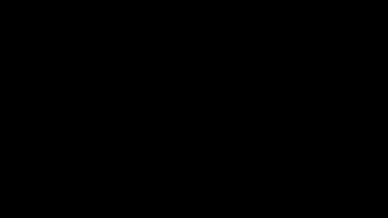
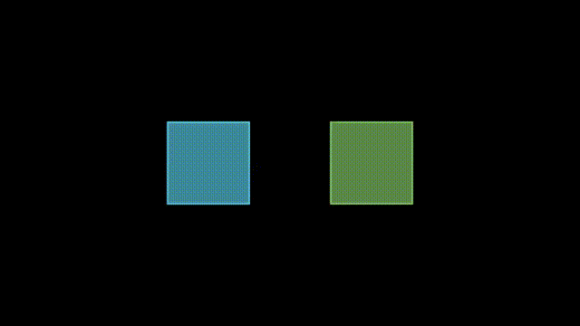
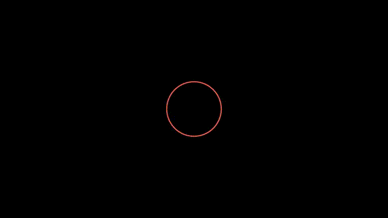

---

# Manim Codes

This repository contains my practice scripts created using [Manim](https://www.manim.community/), a mathematical animation engine.  
Each script demonstrates a specific mathematical or animation concept, along with generated outputs in GIF formats

---


## ⚙️ Installation
1. Clone this repository:
```bash

git clone https://github.com/sahilvirdi01/Manim.git

cd Manim
```
2. Install dependencies:


```bash
pip install -r requirements.txt
```

---

## Running a Script

Use the Manim CLI to render any animation:
```bash
manim -pql src/animate.py AnimateScene
```
### Options:

 - -p → Play after rendering

 - -ql → Render in low quality (faster)

Replace AnimateScene with the actual scene class name in the script.


---

### Codes & Previews
Following are the codes with their outputs.  

   <details>
    <summary><a href="src/example.py">HelloWorld.py</a></summary>
    <p>This program creates a text animation saying "Hello World". </p>
    <h3> Output </h3>
    
   </details>
  
  
   <details>
    <summary><a href="src/animate.py">Animate.py</a></summary>
    <p>This code creates a square that tilts and transforms into circle </p>
    <h3> Output </h3>
    
   </details>
  
  
   <details>
    <summary><a href="src/circle.py">circle.py</a></summary>
    <p>This code creates a circle. </p>
    <h3> Output </h3>
    
   </details>
  
  
   <details>
    <summary><a href="src/mobjects.py">mobjects.py</a></summary>
    <p>This code creates a circle annd a square . </p>
    <h3> Output </h3>
    
   </details>
  
  
   <details>
    <summary><a href="src/rotations.py">rotations.py</a></summary>
    <p>This code creates two squares that plays two different animations</p>
    <h3> Output </h3>
    
   </details>
  
  
   <details>
    <summary><a href="src/square.py">square.py</a></summary>
    <p>This code creates a square. </p>
    <h3> Output </h3>
    
   </details>
  
  
   <details>
    <summary><a href="src/transform.py">transform.py</a></summary>
    <p>This code creates a tilted square that transforms into circle. </p>
    <h3> Output </h3>
    
   </details>
  
  
   <details>
    <summary><a href="src/twotransform.py">twotransform.py</a></summary>
    <p>This code creates animation in which a circle transforms into a square and then square transforms into circle </p>
    <h3> Output </h3>
    
   </details>
  
</ul>

---

### License
No license
<!--This project is licensed under the MIT License.-->

---

